# KAT Subtitle

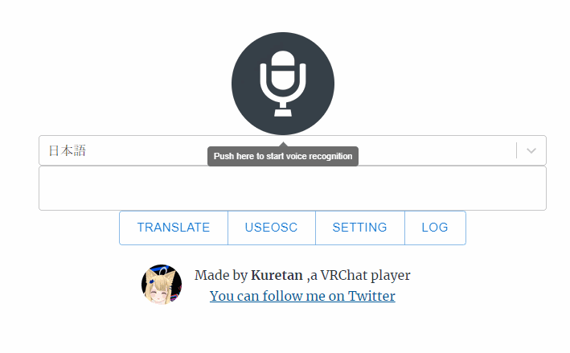

KAT Subtitleは音声認識を用いて、VR Chatでしゃべった言葉を文字として表示することのできるソフトウェアです。また自動翻訳や外部ソフトを利用することでの音声合成も可能です。NGワード除去機能付きなので、音声認識や翻訳ミスによる誤解を防ぐこともできます。

## 動作環境

[Kuretan Avatar Text](https://kuretan.booth.pm/items/3962022)

[Google Chrome](https://www.google.com/chrome/)(Web Speech APIに利用します)

Web Speech APIの仕様状、Chronium(Edge)では挙動が不安定です。Chromeを使用してください。

## 導入方法

### サンプルアバターを使用する場合
[KAT Subtitles](https://kuretan.booth.pm/items/3962809)をダウンロード

↓

KAT_Subtitle.exeを起動

### 自分のアバターに導入する場合
[Kuretan Avatar Text ](https://kuretan.booth.pm/items/3962022)をご自身のアバターに導入してください。
以降はサンプルアバターを使用するのと同じです。

## 主な機能

- タイピング or 音声認識した文章をVR Chat上で表示
- VRChat公式のテキストチャットへの文字の送信
- 入力した文章のログの記録
- Google 翻訳/DeepL 翻訳を用いて翻訳した文章をVR Chatで表示
- 外部ソフトを用いた音声合成

## 使い方

### KAT　Subtitleの起動

KAT_Subtitle.exeを起動すると、ターミナル画面が表示されます。ターミナル画面にはログが表示されます。

KAT Subtitleを終了する際はこのターミナル画面を閉じてください
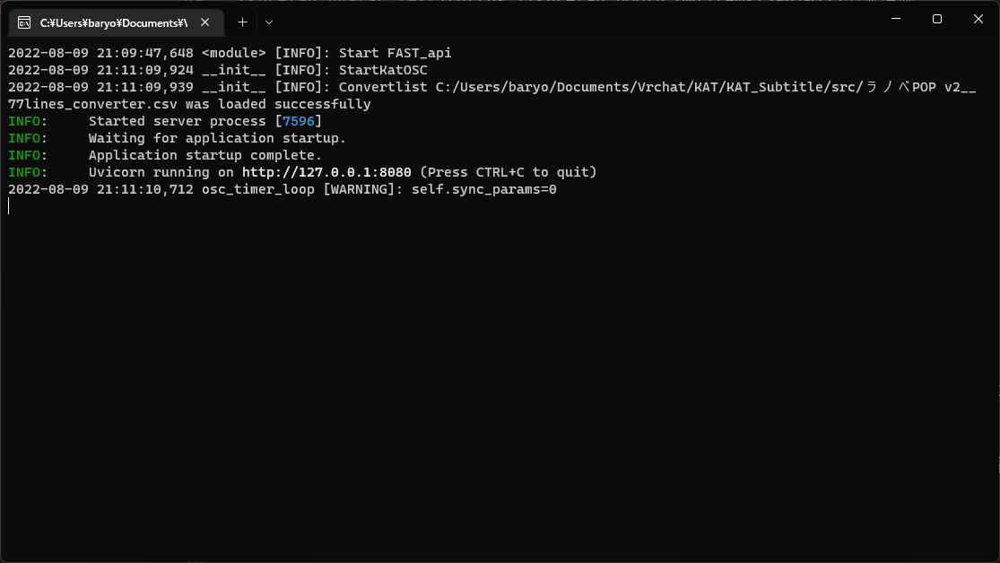

しばらく待つとconvertlistの選択画面が起動します。
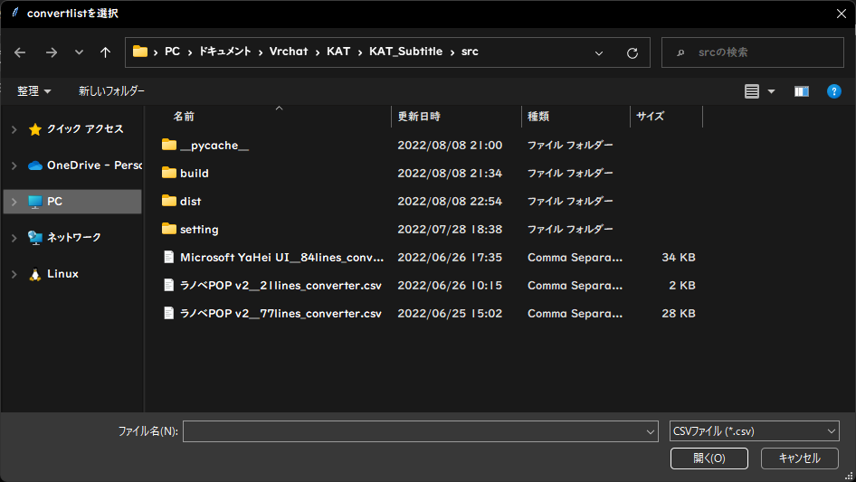

VR ChatのOSCは使用上数値しか送ることができません。そのため、文字を数値に変換する必要があります。
convertlistは数値を文字に変換するために使用する表にあたります。
選択画面が表示されましたら、ご自身の環境に合わせてファイルを選択してください。

[Kuretan Avatar Text](https://kuretan.booth.pm/items/3962022)の無償版

>ラノベPOP v2__21lines_converter.csv、

[Kuretan Avatar Text](https://kuretan.booth.pm/items/3962022)の漢字対応版

>ラノベPOP v2__77lines_converter.csv

[KAT　Charmapmaker](https://kuretan.booth.pm/items/3962822)を利用する場合

>ご自身で作成されたconvertlist.csv

ファイル選択後、Webアプリ[KAT Subtitle](https://kuretan-lab.com/)とが起動します。

### 音声認識&手動入力

マイクのアイコンを押すと音声認識が開始されます。

認識された音声は画面の中央部に表示された後、ローカルサーバーを通じてVR Chatに送られます。送信された文字はターミナル画面に表示されます。非対応の文字を入力した場合は以下のような警告が表示されます。
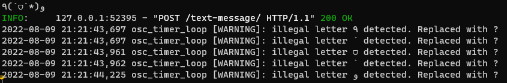
KAT Subtitleでは非対応の文字を?の記号に置き換えています。

非対応の文字だけど、VR Chat上で表示させたいという方は、ご自身で文字データーを作成されるか、あるいは[KAT　Charmapmaker](https://kuretan.booth.pm/items/3962822)のご購入をおすすめします。一般的な日本語の文章が入力できれば十分という方には[Kuretan Avatar Text](https://kuretan.booth.pm/items/3962022)の漢字対応版をおすすめします。

音声認識中に文字数が64文字を超えた場合、超過した文字はVR Chat上では表示されません。

KAT Subtitleはタイピングによる手入力に対応しています。エディタ上に、直接文字を入力してください。
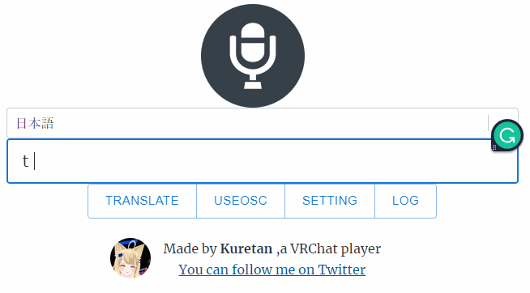

## 公式テキストチャットに対応

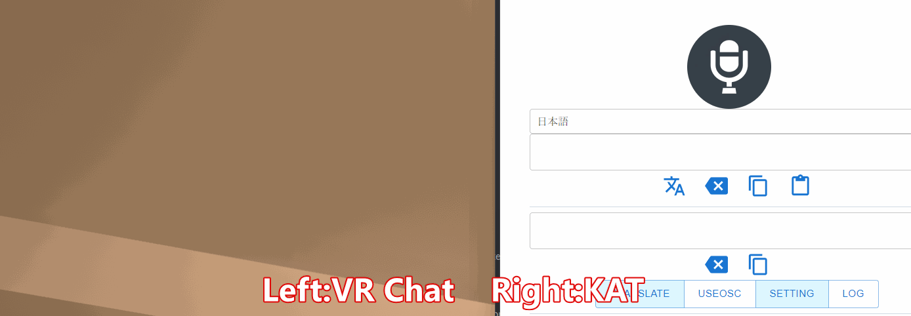
VR　Chatは現在公式にテキストチャットの導入を進めています。

KATは公式のテキストチャットにも対応しています。
しかし、公式のテキストチャットはアスキー文字のみ対応しているため、
日本語の使用はできません。

### 翻訳に関して

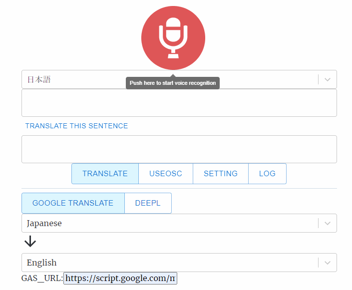

画面の中央部のプルダウンメニューから聞き取る言語を指定します。TRANSLATEボタンをクリックすると翻訳に関する項目が現れます。
翻訳機能は外部APIを利用している関係上、デフォルトでは機能せず、設定が必要です。
現在はGoogle翻訳(Google App Script)とDeep Lに対応しています。

Google翻訳を利用する場合は翻訳元言語と翻訳先言語を指定してください。
DeepLでは翻訳後の言語の指定のみでOKです。

音声認識した文章に関しては自動で翻訳されますが、手動で入力した場合は
手動でボタンをクリックしてください。

### Google翻訳(Google App Script)を用いた翻訳方法

以下の記事にしたがい、翻訳用APIのURLを取得してください。

[3 分で作る無料の翻訳 API with Google Apps Script \- Qiita](https://qiita.com/tanabee/items/c79c5c28ba0537112922)

この記事に従うと下記のようなURLが取得できます。(このURLは実際には機能しません。)

https://script.google.com/macros/s/TC7lrH6Wvgfvdfvgdbtrr9fVJ6z_ghf6ZIrg4wf85FKkI6AzG/exec

このURLをGAS_URLの欄に貼り付けてください。入力したURLはローカルサーバーに保存されるので、一度入力すれば以降は入力が不要となります。
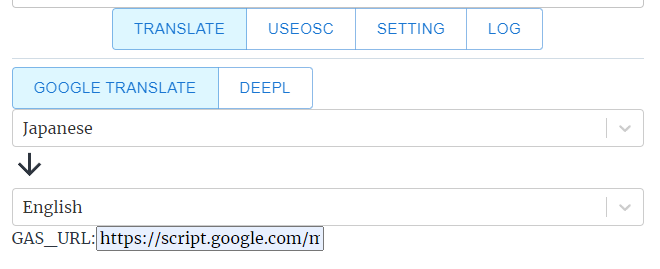

## DeepLを用いた翻訳

DeepL翻訳にはDeepLのAPIを利用します。

APIの利用にはAuthentication Keyが必要です。取得にはDeepLへ登録する必要があります。

[DeepL Pro \| Translate Text, Word Docs & Other Docs Securely](https://www.deepl.com/pro/change-plan#developer)

また登録に際してクレジットカードの登録が必要となりますが、無料版を利用する分には料金はかかりません。また現在は無料版のAPIのみ対応しています。

DeepLへのAPI利用申請ができましたら、[DeepL account](https://www.deepl.com/account/summary)内にあるAuthentication Key for DeepL APIをコピーします。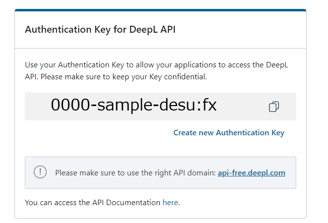

Authentication KeyをKAT SubtitleのDeepL_Authの欄に貼り付けたら設定終了です。Authentication Keyはローカルサーバーに保存されます。

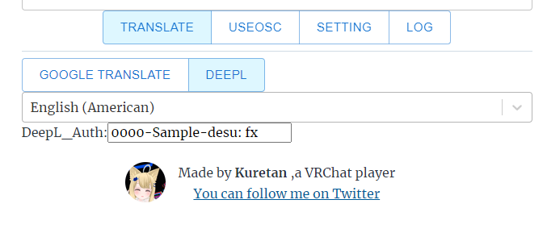

## 音声合成

KAT Subtitleは[棒読みちゃん](https://chi.usamimi.info/Program/Application/BouyomiChan/)に対応しています。
棒読みちゃん対応には[棒読みちゃんWebSocketプラグイン](https://github.com/ryujimiya/Plugin_BymChnWebSocket)を利用します。

棒読みちゃん本体にプラグインを導入してください。KAT Subtitleではデフォルトで音声合成を無効にしています。有効にするにはSettingからMAKE VOICEをONにしてください。

設定終了後は、棒読みちゃんを起動しておくだけで、自動で入力した文章を読み上げてくれるようになります。翻訳をオフにしている際は認識した音声を、翻訳をオンにした際は翻訳語の文章を読み上げてくれます。

棒読みちゃんの音声をVR Chatへ出力する方法に関しては各自Google等で検索してください。

## Setting

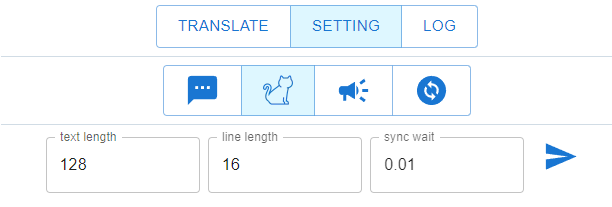

>Change convert file

KAT Subtitleを再起動することなく、convertファイルが変更できるようになりました。

>text length:

VRChat上のアバターが対応しているパラメーター数です。KATインストール時のオプションで指定したtext lengthと同じ値を指定してください。

KATインストール時にオプションを変更していなければ操作は不要です。

サンプルアバターは128です。

>line length：

一行あたりの文字数です。　デフォルトの値は16です。

>sync wait：

OSCの送信間隔です。この値が大きいほど送信に時間がかかりますが、その分文字化け等の同期に関するバグの解消が望めます。

## Log

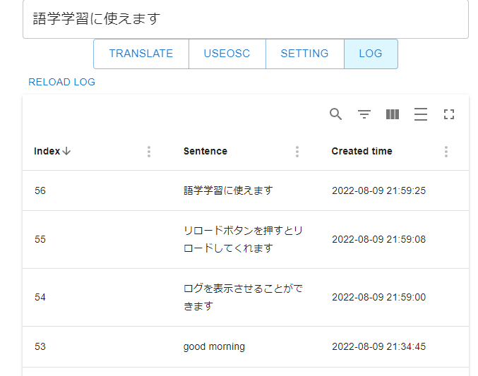

LOGにはこれまでに入力した文章が記録されています。語学学習の際の復習に活用できます。
現在の仕様上、特定の文章を削除、編集することはできません。

またデーターはすべてユーザーのPC内（main.db:SQlite）に保存されており、Webサーバー上には保存されていません。

## 起動オプションについて

exeファイルを起動する際に起動オプションが使用可能です。
詳しくは--h　オプションをつけてexeファイル実行してください。

## APIに関して

APIを公開しています。APIの詳細に関しては、KAT Subtitle起動後、[Swagger UI](http://localhost:8080/docs)を確認してください。APIを利用することで、独自の音声認識ソフトや翻訳ソフトが使用できます。

## NGワード

KAT SubtitleにはNGワード除去機能が備わっています。設定はsettingフォルダ以下のnglist_jp.csvとnglist_en.csvに保存されています。お好みに合わせて設定を変えることが可能です。

## プライバシーに関して

音声入力あるいは翻訳した内容は、外部サーバーで処理を行っている関係上、部外者に内容が伝わるリスクがあることをご留意ください。特にWeb speech apiに関しては、個人情報の扱いに関する規定がはっきりしていません。

このWebサイト自体のプライバシーポリシーに関しては[Privacy Policy \| Kuretan's lab](https://kuretan-lab.com/Privacy/)を確認してください。

## Q&A

### Q.文字化けする・文字が表示されない

### A.以下の事項を確認してください

1. OSCが有効になっているか
2. Convertlistが破損していないか
3. 適切なConvertlistを利用しているか

KATを利用するにはOSCを有効にする必要があります。アクションメニューを開き、Setting->OSC->Enabledを選択してください。

詳細に関しては[OSC Overview](https://docs.vrchat.com/docs/osc-overview)をご確認ください。

またVR ChatのOSC機能は元々不安定です。一度は正常に動作していたのに、急に動かなくなった場合、そのほとんどはVR Chat側の問題です。またVR Chatの仕様上、Show Avatarが必要となることがあります。

### 他人からうまく文字が見えないといわれた

### A.以下の事項を確認してください

1. Quest版を利用していないか
2. セーフティレベルに問題はないか
3. 回線に問題はないか

KATはQuestに対応していないので、Questユーザーには見えません。またセーフティレベルの設定によっては、show avatrが必要となります。回線が重い場合は、適切に表示することができません。

## 開発者向け情報

### フロントエンド

React+Gatsby

### ローカルサーバー

Python(FastAPI)

### データーベース

SQlite

### VR Chatへの文字列の送信

[KillFrenzy Avatar Text OSC App](https://github.com/killfrenzy96/KatOscApp)

### 音声認識API

[Web Speech API](https://developer.chrome.com/blog/voice-driven-web-apps-introduction-to-the-web-speech-api/)

### 翻訳API

[Apps Script  \|  Google Developers](https://developers.google.com/apps-script)

[DeepL API](https://www.deepl.com/pro/change-plan#developer)

### 合成音声

[棒読みちゃんWebSocketプラグイン](https://github.com/ryujimiya/Plugin_BymChnWebSocket)

## ライセンス

本ソフトウェアのローカルサーバーに関してはGNU General Public Licenseで配布しています。Webアプリに関しては現在非公開ですが、将来的には公開する予定です。本ソフトウェアを利用すことによって生じたいかなる損害に対しても私は責任を持ちません。すべて自己責任でよろしくお願いします。

## なぜこのソフトを作成したか

私がVR Chatを始めたきっかけは英語の勉強をするためです。VRチャット上には語学の勉強に熱心な人がたくさんいます。彼らは熱心に言語交換をしていますが、しばしばうまくコミュニケーションがとれないことがあります。そんな際にVR Chat上に任意の文字を表示できたり、翻訳をしてくれる機能があったら便利だと思い、このアプリを作成しました。

## 寄付

KAT SubtitleはKuretan個人により開発されたソフトウェアです。もしKAT Subtitleを気に入っていただけたら、Boothでのブースト購入等で支援がいただけたらありがたいです。TwitterやVR Chat上での感想やコメント・フィードバックもお待ちしています。
