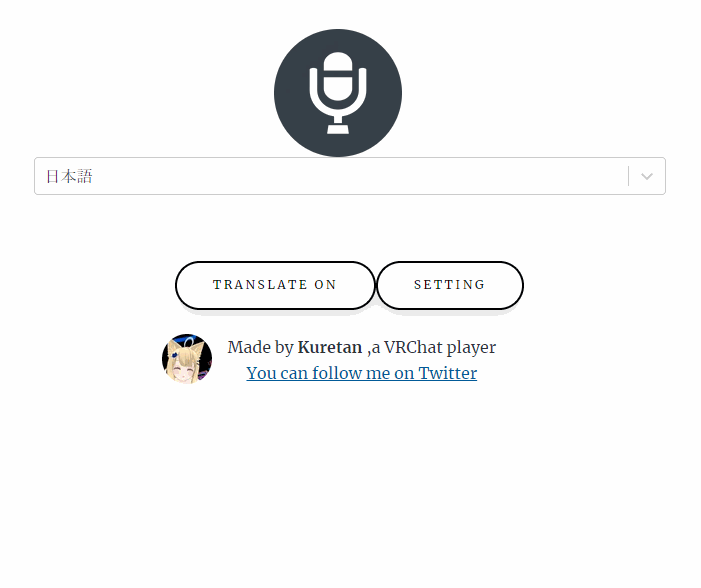

# KAT Subtitle

KAT Subtitleは音声認識を用いて、VR Chatでしゃべった言葉を文字として表示することのできるソフトウェアです。また自動翻訳や外部ソフトを利用することでの音声合成も可能です。NGワード除去機能付きなので、音声認識や翻訳ミスによる誤解を防ぐこともできます。

## 動作環境

[Kuretan Avatar Text](https://kuretan.booth.pm/items/3962022)

[Google Chrome](https://www.google.com/chrome/)(Web Speech APIに利用します)

## 導入方法

[Booth](https://kuretan.booth.pm/items/3962809)からKAT Subtitlesをダウンロード

↓

KAT_Subtitle.exeを起動

## 主な機能

- タイピング or 音声認識した文章をVR Chat上で表示
- Google 翻訳を用いて翻訳した文章VR Chatで表示
- 外部ソフトを用いた音声合成

## 使い方

### 音声入力

KAT_Subtitle.exeを起動すると、convertlistの選択画面が起動します。[Kuretan Avatar Text](https://kuretan.booth.pm/items/3962022)の無償版を利用している方は、ラノベPOP v2__21lines_converter.csvを、漢字対応版を利用されている方はラノベPOP v2__77lines_converter.csv　を選択してください。
Charmapmakerで作成したconvertlistを利用する場合は、ご自身で作成されたconvertlistを選択してください。

ファイル選択後、Chromeのウインドウ[KAT Subtitle \| KAT Subtitle](https://kat-subtitle.netlify.app/)とエディタが起動します。

ChromeのウインドウはWeb Speech APIを用いた音声認識およびGoogle translateによる翻訳に使用します。マイクのアイコンを押すと音声認識が開始されます。

認識された音声は画面の中央部に表示された後、二つ目のウインドウに送られてから、VR Chatに送られます。使用上64文字以上の文章は表示できないため、長文でしゃべることはできません。

### 手動入力

KAT Subtitleはタイピングによる入力にも採用しています。エディタ上に、直接文字を入力してください。文章の最後が「。」または「？」で終了した場合、エディタ上の文章はリセットされます。右側のClearボタンを押しても、テキストを消すことができます。

Windows11をご利用の方は、windows11の標準音声入力をすることも可能です。文字入力欄を選択中にWindows+Hを押すと、音声入力が開始されます。音声入力の設定から句読点の自動挿入をオンにすると、文章が終わると自動的に入力内容がクリアされます。これにより一々文章を削除することなく、スムーズにしゃべり続けることができます。Web Speech APIとWindows11標準の音声入力の精度は大差ありませんので、お好みのほうをご利用ください

### 翻訳（要設定）

Chromeのウインドウの画面の中央部、聞き取る言語の右側にあるプルダウンメニューから聞き取る言語を指定します。翻訳すると書かれたボタンをクリックすると翻訳に関する項目が現れます。翻訳元言語と翻訳先言語を指定してください。音声認識と翻訳では使用しているAPIが異なるため、手動で翻訳元言語は指定してください。

翻訳機能は外部APIを利用している関係上、デフォルトでは機能せず、設定が必要です。現在対応しているAPIはGoogle App Scriptのみです。今後のアプッデートではDeep Lをはじめ、複数の翻訳APIに対応していきます。

### Google App Scriptを用いた翻訳方法

以下の記事にしたがい、翻訳用APIのURLを取得してください。

[3 分で作る無料の翻訳 API with Google Apps Script \- Qiita](https://qiita.com/tanabee/items/c79c5c28ba0537112922)

この記事に従うと下記のようなURLが取得できます。(このURLは実際には機能しません。)

https://script.google.com/macros/s/TC7lrH6Wvgfvdfvgdbtrr9fVJ6z_ghf6ZIrg4wf85FKkI6AzG/exec

このURLをsettingのGASの欄に貼り付けてください。

### 音声合成

KAT Subtitleは[棒読みちゃん](https://chi.usamimi.info/Program/Application/BouyomiChan/)に対応しています。
棒読みちゃん対応には[棒読みちゃんWebSocketプラグイン](https://github.com/ryujimiya/Plugin_BymChnWebSocket)を利用します。棒読みちゃん本体にプラグインを導入してください。プラグイン導入後、KAT Subtitle起動と同時に棒読みちゃんを起動するだけで、後は棒読みちゃんが読み上げてくれるようになります。翻訳をオフにしている際は認識した音声を、翻訳をオンにした際は翻訳語の文章を読み上げてくれます。音声のON/OFFはブラウザの画面上のSetting->MAKE VOICEで調整できます。

合成した音声のVR Chatへの出力方法に関しては各自Google等で検索してください。

## NGワード

KAT SubtitleにはNGワード除去機能が備わっています。設定はsettingフォルダ以下のnglist_jp.csvとnglist_en.csvに保存されていますので、お好みに合わせて設定を変えることが可能です。

## プライバシー面に関して

音声入力あるいは翻訳した内容は、外部サーバーで処理を行っている関係上、部外者に内容が伝わるリスクがあることをご留意ください。特にWeb speech apiに関しては、個人情報の扱いに関する規定がはっきりしていません。
KAT Subtitle利用時はくれぐれも機密情報や個人情報を入力しないでください。

## Q&A

Q.文字化けする・文字が表示されない

A.OSCが有効になっているか・Convertlistが破損していないか・Convertlistが現在使用しているシェーダーの画像に対応しているかを確認してください。

KATを利用するにはOSCを有効にする必要があります。アクションメニューを開き、Setting->OSC->Enabledを選択してください。

詳細に関しては[OSC Overview](https://docs.vrchat.com/docs/osc-overview)をご確認ください。

またVR ChatのOSC機能は元々不安定です。一度は正常に動作していたのに、急に動かなくなった場合、そのほとんどはVR Chat側の問題です。

## 開発者向け情報

VR Chatへの文字列の送信に関しては[KillFrenzy Avatar Text OSC App](https://github.com/killfrenzy96/KatOscApp)を,音声認識部分に関しては[Web Speech API](https://developer.chrome.com/blog/voice-driven-web-apps-introduction-to-the-web-speech-api/)を、翻訳に関して[Apps Script  \|  Google Developers](https://developers.google.com/apps-script)の翻訳機能を利用しています。また棒読みちゃんとの連携に関しては[棒読みちゃんWebSocketプラグイン](https://github.com/ryujimiya/Plugin_BymChnWebSocket)を利用しています。

## 使用しているライブラリ

[KillFrenzy Avatar Text OSC App](https://github.com/killfrenzy96/KatOscApp)

[Web Speech API](https://developer.chrome.com/blog/voice-driven-web-apps-introduction-to-the-web-speech-api/)

[棒読みちゃんWebSocketプラグイン](https://github.com/ryujimiya/Plugin_BymChnWebSocket)

## ライセンス

本ソフトウェアはGNU General Public Licenseで配布しています。本ソフトウェアを利用すことによって生じたいかなる損害に対しても私は責任を持ちません。すべて自己責任でよろしくお願いします。

## なぜこのソフトを作成したか

私がVR Chatを始めたきっかけは英語の勉強をするためです。VRチャット上には語学の勉強に熱心な人がたくさんいます。彼らは熱心に言語交換をしていますが、しばしばうまくコミュニケーションがとれないことがあります。そんな際にVR Chat上に任意の文字を表示できたり、翻訳をしてくれる機能があったら便利だと思い、このアプリを作成しました。

## 寄付

KAT SubtitleはKuretan個人により開発されたソフトウェアです。もしKAT Subtitleを気に入っていただけたら、Boothでのブースト購入等で支援がいただけたらありがたいです。TwitterやVR Chat上での感想やコメント・フィードバックもお待ちしています。
