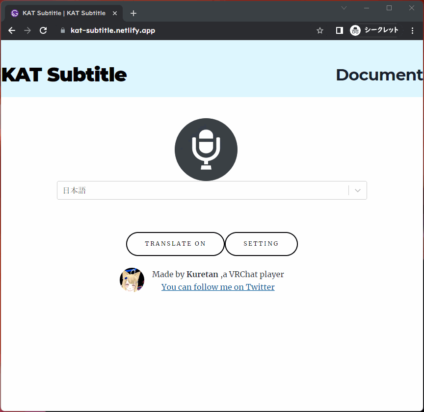

# KAT Subtitle

KAT Subtitleは音声認識を用いて、VR Chatでしゃべった言葉を文字として表示することのできるソフトウェアです。また自動翻訳や外部ソフトを利用することでの音声合成も可能です。

## 動作環境

Kuretan Avatar Text

Google Chrome(Web Speech APIに利用します)

## 導入方法

リリースまたはBoothからKAT Subtitlesをダウンロード

↓

KAT_Subtitle.exeを起動

### Charmapmakerを利用する場合

KAT_Subtitle.exeと同じ階層のフォルダにCharmap Makerで作成したConvertlist.csvを導入してください。
元々入っているConvertlistはサンプルアバター専用ですので、不要です。上書きして問題ありません。

## 主な機能

- 音声を入力
- 入力内容の相互翻訳
- 外部ソフトを用いた音声合成

## 使い方

### 音声入力

KAT_Subtitle.exeを起動すると、Chromeのウインドウ（localhost:8002)とエディタが起動します。

ChromeのウインドウはWeb Speech APIを用いた音声認識およびGoogle translateによる翻訳に使用します。マイクのアイコンを押すと音声認識が開始されます。

認識された音声は画面の中央部に表示された後、二つ目のウインドウに送られてから、VR Chatに送られます。使用上32文字以上の文章は表示できないため、長文でしゃべることはできません。

### 手動入力

KAT Subtitleはタイピングによる入力にも採用しています。エディタ上に、直接文字を入力してください。文章の最後が「。」または「？」で終了した場合、エディタ上の文章はリセットされます。右側のClearボタンを押しても、テキストを消すことができます。

Windows11をご利用の方は、windows11の標準音声入力をすることも可能です。文字入力欄を選択中にWindows+Hを押すと、音声入力が開始されます。音声入力の設定から句読点の自動挿入をオンにすると、文章が終わると自動的に入力内容がクリアされます。これにより一々文章を削除することなく、スムーズにしゃべり続けることができます。

Web Speech APIとWindows11標準の音声入力の精度は大差ありませんので、お好みのほうをご利用ください。またいずれの音声入力も外部での音声認識を行っているため、部外者に内容が伝わる可能性があることをご留意ください。

### 翻訳（要設定）

Chromeのウインドウの画面の中央部、聞き取る言語の右側にあるプルダウンメニューから聞き取る言語を指定します。翻訳すると書かれたボタンをクリックすると翻訳に関する項目が現れます。翻訳元言語と翻訳先言語を指定してください。音声認識と翻訳では使用しているAPIが異なるため、手動で翻訳元言語は指定してください。

翻訳機能は外部APIを利用している関係上、デフォルトでは機能せず、設定が必要です。現在対応しているAPIはGoogle App Scriptのみです。今後のアプッデートではDeep Lをはじめ、複数の翻訳APIに対応していきます。

### Google App Scriptを用いた翻訳方法

以下の記事にしたがい、翻訳用APIのURLを取得してください。

[3 分で作る無料の翻訳 API with Google Apps Script \- Qiita](https://qiita.com/tanabee/items/c79c5c28ba0537112922)

この記事に従うと下記のようなURLが取得できます。(このURLは実際には機能しません。)

https://script.google.com/macros/s/TC7lrH6Wvgfvdfvgdbtrr9fVJ6z_ghf6ZIrg4wf85FKkI6AzG/exec?text=

取得したURLをjsフォルダ下にあるsetting.jsに以下のように記入します。改行せず一行で記入してください。

    const  url_base="https://script.google.com/macros/s/TC7lrH6Wvgfvdfvgdbtrr9fVJ6z_ghf6ZIrg4wf85FKkI6AzG/exec?text="

### 音声合成

KAT Subtitleは[棒読みちゃん](https://chi.usamimi.info/Program/Application/BouyomiChan/)に対応しています。
棒読みちゃん対応には[棒読みちゃんWebSocketプラグイン](https://github.com/ryujimiya/Plugin_BymChnWebSocket)を利用します。棒読みちゃん本体のプラグインの設定ができたら、bouyomichan_client.jsというファイルをjsフォルダ化に保存します。

このプラグインを導入することで棒読みちゃんに発声させることができます。翻訳をオフにしている際は認識した音声を、翻訳をオンにした際は翻訳語の文章を読み上げてくれます。

## Q&A

Q.文字化けする・文字が表示されない

A.OSCが有効になっているか・Convertlistが破損していないか・Convertlistが現在使用しているシェーダーの画像に対応しているかを確認してください。

Q.音声認識・翻訳されない

A.ネットワークに問題があるか、過剰利用が原因でGoogleに規制されいる可能性があります。

Q.Chromeの読み込みがいつまでも終わらない

A.アプリを再起動してください。KAT Subtitleではローカルサーバーを利用します。これはChromeの関係上、ローカルサーバーを利用しないと、不具合が生じるからです。しかし、環境によってはローカルサーバーの立ち上げに問題が生じることがあります。

問題が生じた場合は、ご自身でローカルサーバーを別に立てるか、index.htmlを直接chromeで開いてください。

## 開発者向け情報

VR Chatへの文字列の送信に関しては[KillFrenzy Avatar Text OSC App](https://github.com/killfrenzy96/KatOscApp)を,音声認識部分に関しては[Web Speech API](https://developer.chrome.com/blog/voice-driven-web-apps-introduction-to-the-web-speech-api/)を、翻訳に関して[Apps Script  \|  Google Developers](https://developers.google.com/apps-script)の翻訳機能を利用しています。また棒読みちゃんとの連携に関しては[棒読みちゃんWebSocketプラグイン](https://github.com/ryujimiya/Plugin_BymChnWebSocket)を利用しています。

## 使用しているライブラリ

[KillFrenzy Avatar Text OSC App](https://github.com/killfrenzy96/KatOscApp)

[Web Speech API](https://developer.chrome.com/blog/voice-driven-web-apps-introduction-to-the-web-speech-api/)

[棒読みちゃんWebSocketプラグイン](https://github.com/ryujimiya/Plugin_BymChnWebSocket)

## ライセンス

本ソフトウェアはGNU General Public Licenseで配布しています。

## なぜこのソフトを作成したか

私がVR Chatを始めたきっかけは英語の勉強をするためです。VRチャット上には語学の勉強に熱心な人がたくさんいます。彼らは熱心に言語交換をしていますが、しばしばうまくコミュニケーションがとれないことがあります。そんな際にVR Chat上に任意の文字を表示できたり、翻訳をしてくれる機能があったら便利だと思い、このアプリを作成しました。

## 寄付

KAT SubtitleはKuretan個人により開発されたソフトウェアです。もしKAT Subtitleを気に入っていただけたら、Boothでのブースト購入等で支援がいただけたらありがたいです。TwitterやVR Chat上での感想やコメント・フィードバックもお待ちしています。
